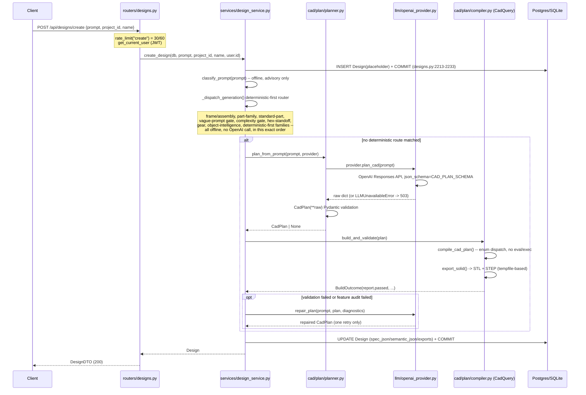

# Request Data Flow: Text-to-CAD and Drawing-to-CAD

Both request paths verified end to end against the current tree
(`hardening/export-integrity`, HEAD `68f3eba`) by direct file reads this
session, cross-checked by two independent background research passes.
File:line citations point at the code that was actually read, not inferred.

---

## 1. Text-to-CAD: `POST /api/designs/create`



### Key files and exact behavior

| Step | File : line | Behavior |
|---|---|---|
| Route + auth + rate limit | `backend/app/routers/designs.py:222-248` | `@router.post("/create", dependencies=[rate_limit("create")])`; `user: User = Depends(get_current_user)` — every design route requires a valid bearer JWT (`auth/deps.py:16-38`). |
| Placeholder commit | `design_service.py:2225-2233` | The `Design` row is committed **before** any slow LLM/CadQuery work, specifically to avoid holding a SQLite write lock across multi-second generation (comment at `2227-2231`). |
| Deterministic-first routing | `design_service.py:2265-2438` (`_dispatch_generation`) | ~10 ordered gates (frame families, part-family router, standard-part resolver, vague-prompt gate, everyday-object gate, complexity/decomposition gate, hex-standoff, gear, object-intelligence, curated `DETERMINISTIC_FIRST_FAMILIES` set at `2445-2452`) all run **before** any OpenAI call, so a large fraction of prompts never touch the network and can't time out. |
| CadPlan primary route | `design_service.py:1525-1639` (`_try_cad_plan`) | `plan_from_prompt` -> Pydantic `CadPlan` -> `build_and_validate` -> (on fatal failure) one `repair_plan` retry -> (on feature-audit failure) one more repair -> (on critical-failure validation) one `_attempt_recovery` pass. At most 2 total repair/recovery attempts per request. |
| Total time budget | `design_service.py:2437` | `with generation_budget(settings.cad_generation_timeout_seconds):` wraps the entire LLM/CadPlan fallback chain — default 120s (`config.py:154`). Cooperative (checked between calls), not an OS-level preemptive kill — see the production-readiness audit's isolation finding. |
| Compile | `cad/plan/compiler.py:513-601` -> `cad/plan/planner.py:63-68` | `compile_cad_plan(plan)` dispatches on the closed `FeatureKind` enum; `export_solid` calls `app/export/exporter.py` (`_export_bytes`, tempfile-based STL/STEP write). |
| Persist result | `design_service.py:1631,1637-1638` (`_store_plan`, then commit/refresh) | Writes `semantic_json`, `bounding_box`, `spec_hash`, export rows. |
| Response shaping | `routers/designs.py:90-194` (`_to_dto`) | Assembles `DesignDTO` from the `Design` row — no additional generation happens here. |

### Edit / regenerate / export sub-paths (same trust boundary)

- `POST /{id}/modify` -> `design_service.modify_design` -> `provider.parse_modification()` (OpenAI, `DESIGN_MODIFICATION_SCHEMA`) -> `DesignModification` (Pydantic) -> `apply_modification()` (`design_spec.py:277-330`, pure arithmetic on validated floats, no model call at the geometry step).
- `POST /{id}/face-edit`, `/localized-edit`, `/circle-edit` -> `app/editing/face_edit.py` / `app/editing/localized.py` -> classify instruction into a constrained enum operation -> mutate the trusted `DesignSpec`/`CadPlan` -> regenerate via the same `apply_spec_edit`/`apply_plan_edit` -> `_regenerate_geometry` path (`design_service.py:267-399`). `guard_critical=True` on face/circle edits means a regression is rolled back rather than replacing a good design with a broken one (`designs.py:716-724`).
- `GET /{id}/files/{fmt}` -> `_owned_or_404` -> `_block_export_if_critical` (409 if the design failed critical validation, dev-only override) -> `storage.read()` or `storage.signed_url()` (`designs.py:312-352`).

---

## 2. Drawing-to-CAD: `POST /api/drawings/to-cad` (and `/generate`, `/interpret`)

```mermaid
sequenceDiagram
    participant C as Client
    participant R as routers/drawings.py
    participant UG as services/upload_guard.py
    participant ING as services/drawing_ingest.py
    participant JOB as services/drawing_jobs.py
    participant CV as drawing/* (CV pipeline)
    participant OAI as llm/openai_provider.py (vision)
    participant DS as services/design_service.py

    C->>R: POST /api/drawings/to-cad (multipart file + notes/units/family)
    Note over R: rate_limit("drawing") = 12/60<br/>get_current_user
    R->>UG: read_upload_bounded(file) -- chunked, refuses >20MB
    R->>UG: inspect_upload(data, filename, content_type)
    UG->>UG: detect_file_type() from BYTES (magic numbers), not filename/header
    alt raster (PNG/JPEG/WEBP)
        UG->>UG: PIL decompression-bomb + dimension caps, re-encode strips metadata
    else PDF
        UG->>UG: pypdfium2 page-count cap (25), corrupt/encrypted rejected
    else SVG
        UG->>UG: regex scan (DOCTYPE/ENTITY/script/on*=/foreignObject/external refs)<br/>then hardened xml.etree parse, entity-decl handler raises
    else DXF
        UG->>UG: entity/layer count caps, non-finite/oversized coordinate rejection
    end
    UG-->>R: InspectedUpload | raise UploadRejected (413/415/422)
    R->>JOB: create_job(user.id); run_job(job, pipeline) -- daemon thread, 202 + job_id
    C->>R: GET /api/drawings/jobs/{id} (poll)
    par background thread
        JOB->>ING: ingest_drawing(data, filename, content_type)
        alt vector (DXF/SVG)
            ING-->>JOB: exact geometry, no vision call
            JOB->>DS: create_design_from_plan(...)
        else raster / rasterized PDF
            JOB->>CV: extract_profile(), detect_flanged_branch(), detect_side_branch()
            Note over CV: deterministic pixel analysis runs BEFORE any LLM call
            opt vision available and no notes-only fast path
                JOB->>OAI: interpret_image() -- base64 data: URL, bounded budget
                OAI->>OAI: DRAWING_INTERPRETATION_SCHEMA structured output
                OAI-->>JOB: raw dict -> DrawingInterpretationSpec (Pydantic)
            end
            JOB->>JOB: route selection: sketch-reconstruction vs profile-extrusion<br/>vs hybrid-branch vs vision-interpretation vs deterministic fallback
            JOB->>DS: create_design_from_plan() or _generate_from_interpretation()
        end
        JOB->>JOB: topology_coverage() + enforce_sketch_feature_contract()<br/>reject candidate if built model doesn't match detected features
    end
    JOB-->>C: poll result {generated, analysis, design, message}
```

### Key files and exact behavior

| Step | File : line | Behavior |
|---|---|---|
| Upload gate (single shared choke point) | `backend/app/services/upload_guard.py` (429 lines, full) | `MAX_UPLOAD_BYTES=20MB`, `MAX_IMAGE_BYTES=12MB`, `MAX_IMAGE_DIMENSION=12000px`, `MAX_IMAGE_PIXELS=40MP`, `MAX_PDF_PAGES=25`, `MAX_SVG_BYTES=8MB`/`MAX_SVG_NODES=50000`, `MAX_DXF_BYTES=16MB`/`MAX_DXF_ENTITIES=200000`/`MAX_DXF_LAYERS=2000`/`MAX_DXF_COORDINATE=1e9`. Used identically by `/interpret`, `/generate`, `/to-cad`, and the `/api/drawing-to-cad` alias (`drawings.py:38-64,74-119,235-275,581-633`) — one gate, no drift between endpoints. |
| Bounded read | `upload_guard.py:325-344` (`read_upload_bounded`) | Chunked `await file.read(chunk_size)` loop that aborts the instant the running total exceeds the limit — never buffers an over-budget body into memory (the pre-hardening bug this replaced, per the commit message on `68f3eba`). |
| Type detection | `services/drawing_ingest.py` (`detect_file_type`, referenced from `upload_guard.py:31-34,399`) | Content-sniffed from bytes first; extension/Content-Type are only a fallback for signature-less files — a mismatch between claimed raster type and actual magic bytes is rejected (`upload_guard.py:406-413`). |
| Async job model | `services/drawing_jobs.py` (174 lines, full) | `POST /generate` and `POST /to-cad` return `202 {job_id, poll}` immediately; the actual pipeline runs on `threading.Thread(daemon=True)` (line 173) inside the **same uvicorn process** (docstring, lines 9-12) — not a separate worker/queue. `sync=true` (scripts/tests only) runs inline. |
| Vector path (DXF/SVG) | `routers/drawings.py:301-333` | `drawing_to_spec.analysis_from_vector()` -> `plan_from_analysis()` -> `design_service.create_design_from_plan()`. No OpenAI call — exact geometry from parsed vector data. (Internals of `drawing_to_spec.py` not independently re-read this session — see Known Unknowns.) |
| Raster path — deterministic-first | `routers/drawings.py:335-457` | `extract_profile()`, `detect_flanged_branch()`, `detect_side_branch()` all run as pure CV (no network) **before** any vision call; a "notes fast path" (explicit user-supplied parameters) can bypass vision entirely (`drawings.py:387-388`). |
| Vision call | `drawing/interpret.py:interpret_image` (23-160) -> `openai_provider.py:238-288` (`interpret_drawing`) | Image sent as a base64 `data:` URL (never a fetched URL — no SSRF surface here), under a `generation_budget` shorter than the CAD budget (`drawing_provider_timeout_seconds=75`, `config.py:167`), with one bounded compressed-image retry (`interpret.py:74-85`). Response validated into `DrawingInterpretationSpec`; on `ValidationError`, a sanitize-and-retry pass, then a partial-interpretation degrade — never a silent 0%/unknown without an explicit `provider_error` (`interpret.py:105-160`). |
| Route selection | `routers/drawings.py:448-576` | Sketch-reconstruction (structured features: counterbores, slots, polygon holes) is preferred over plain profile-extrusion whenever the reconstructed IR is feature-richer, with an explicit route guard (`_route_guard_sketch_over_profile`, line 826) so a feature-dropping candidate can never silently win. |
| Post-build honesty gates | `routers/drawings.py:987-1030` (`topology_coverage`, `enforce_sketch_feature_contract`) | A built model whose measured hole/feature count doesn't match what was detected in the drawing is **rejected** (design deleted, `db.delete(design)`) rather than shipped as a silently-wrong result, unless a "keep as review" path applies for a dimensioned mechanical drawing. |
| Deterministic fallback | `routers/drawings.py:1113-1158` (`_deterministic_fallback_response`) | On provider outage/weak read, `drawing_best_effort.generate_best_effort_from_drawing()` produces a REVIEW-flagged model from CV linework alone — a provider failure is never silently a `generic_mechanical_part` cube. |
| Job polling / ownership | `routers/drawings.py:152-164`, `drawing_jobs.py:100-106` (`get_job`) | `get_job(job_id, user.id)` returns `None` (-> 404) if the job belongs to another user — no cross-user job enumeration. |

---

## 3. Trust-boundary diagram (request-flow perspective)

```mermaid
flowchart TB
    subgraph Internet["Untrusted network"]
        Client[Browser / API client]
    end
    subgraph Edge["Edge (not represented in repo — see audit doc Deployment section)"]
        Proxy["Reverse proxy (README describes Nginx;\nno nginx.conf/systemd unit in repo)"]
    end
    subgraph API["FastAPI process (single uvicorn worker documented)"]
        CORS[CORSMiddleware — allow_credentials=True,\nexplicit origin allowlist]
        RL[rate_limit() — per-process in-memory\nsliding window, category-keyed]
        Auth[get_current_user — JWT HS256,\nno iss/aud check, no revocation list]
        Own["_owned_or_404 / user_owns_design —\nnon-owner and non-existent both 404"]
        UG[upload_guard — size/type/pixel/page/\nentity/coordinate limits]
        Val["Pydantic validation layer\n(DesignSpec / CadPlan / CADFeatureGraph /\nDrawingInterpretationSpec)"]
        Gen["Deterministic builders / CadPlan compiler /\nfeature-graph interpreter — enum dispatch only"]
        Jobs["drawing_jobs — in-process daemon threads,\nno concurrency cap, watchdog marks failed\nbut does not kill the thread"]
    end
    subgraph Data["Data plane"]
        DB[(Postgres/SQLite via SQLAlchemy ORM\n— no raw SQL string building found)]
        Storage["LocalStorage/S3Storage —\npath-traversal-checked keys,\nS3 presigned URLs (TTL 3600s default)"]
    end
    subgraph External["External services"]
        OpenAI[OpenAI Responses API\n— structured outputs, per-request timeout]
    end

    Client -->|HTTPS, bearer JWT| Proxy --> CORS --> RL --> Auth --> Own
    Auth -.401.-> Client
    Own -.404.-> Client
    RL -.429.-> Client
    Client -->|multipart upload| UG
    UG -.413/415/422.-> Client
    UG --> Val
    Own --> Val
    Val -->|validated model only| Gen
    Val -.422 on schema failure.-> Client
    Gen --> DB
    Gen --> Storage
    Gen -->|prompt text / base64 image, never a fetched URL| OpenAI
    OpenAI -->|JSON text only| Val
    Own --> Jobs
    Jobs --> Gen
    Storage -->|signed URL redirect or streamed bytes| Client
```

The two load-bearing boundaries in this diagram are **Auth/Ownership** (every
non-public route requires a valid JWT and an ownership check that returns an
identical 404 for "not yours" and "doesn't exist" — verified via
`backend/tests/test_phase2_authorization.py`, 334 lines, full read by the
background research agent this session) and **Pydantic validation** (nothing
model- or user-controlled reaches a geometry builder without passing through
a closed schema first — see `docs/architecture/generation-boundary.md`).

---

## 4. Known unknowns / not independently verified this session

- **`app/services/drawing_to_spec.py`** internals (vector-path analysis and
  plan construction) — referenced but not read directly; see the same note
  in `generation-boundary.md`.
- **The reverse-proxy/edge layer** — nothing in this repo defines it (no
  `nginx.conf`, no systemd unit); the "Edge" box above is drawn from README
  prose only (`README.md:556-567`, quoted in the audit doc), not from a
  file this session could execute or lint.
- **Whether `TRUST_PROXY_HEADERS` is actually set correctly in the real
  deployment** — the code correctly defaults it off and documents the risk
  of enabling it incorrectly (`rate_limit.py:100-121`), but the actual
  production nginx config (if one exists outside this repo) was not
  available to check that it truly overwrites `X-Forwarded-For` as assumed.
