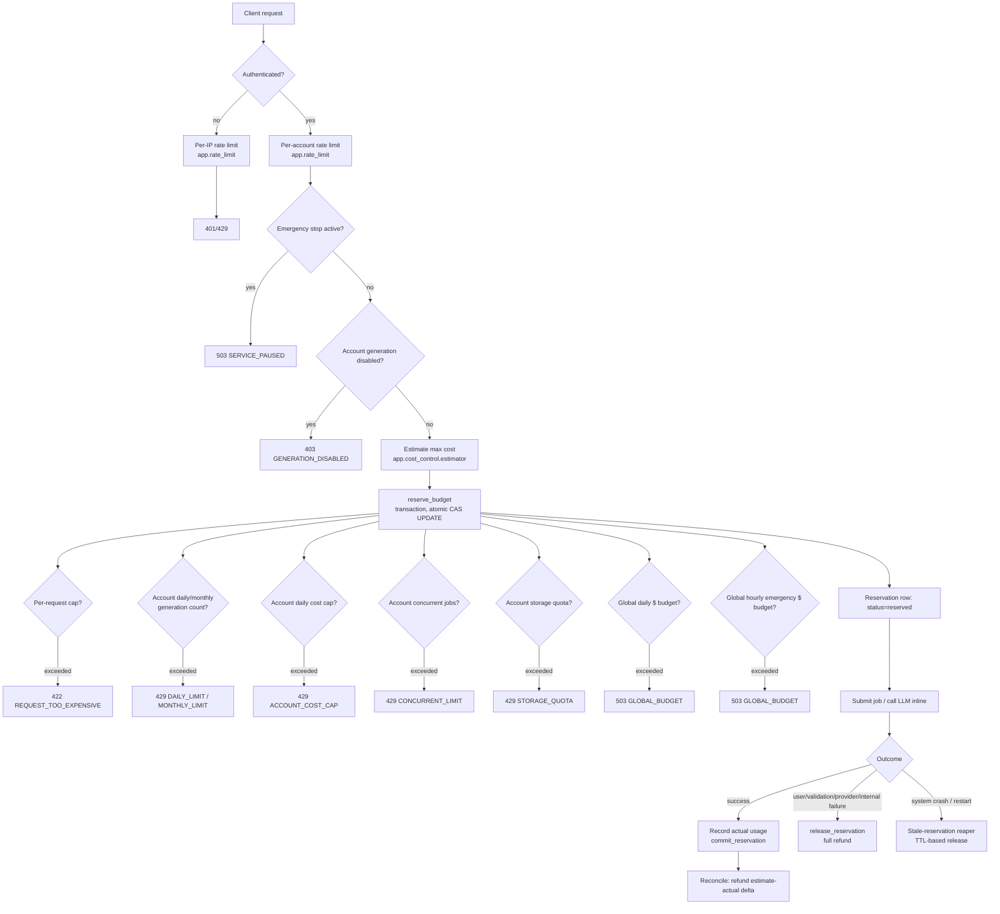

# Cost-control architecture

Branch: `beta-readiness/release-candidate-20260730`. This document maps every
cost-producing operation in LunaiCAD and the budget-check points added around
them (`app/cost_control/`). It is the design reference for
`docs/security/dependency-risk-assessment.md`'s sibling doc in spirit: a
source-backed map, not a plan.

## 1. Every cost-producing operation

| Resource | Where it's spent | Existing protection (pre-this-change) | Gap this change closes |
|---|---|---|---|
| OpenAI tokens (text) | `app/llm/openai_provider.py::_run`, called from `parse_prompt_to_design_spec`, `parse_modification`, `repair`, `plan_cad`/`plan_feature_graph`/`plan_general_cad` | SDK-level retry+timeout, model-fallback wall-clock budget (`app/llm/budget.py`), global in-memory circuit breaker (`app/llm/circuit_breaker.py`, daily $ cap + failure-rate trip) | No pre-flight per-request cost estimate/cap; no per-account cost tracking at all; circuit breaker is per-process (resets on restart, doesn't see other workers) |
| OpenAI tokens (vision) | Same `_run`, via `interpret_drawing` — the single most expensive call class (`detail: "high"` images) | Same as above | Same as above, and `/api/drawings/interpret` runs fully inline with **no quota check of any kind** before the call today |
| OpenAI retries | SDK `max_retries` (`openai_max_retries`) + manual model-fallback chain in `_run` | Bounded by `openai_max_retries` and the shared wall-clock budget | Retries were not counted against any per-request or per-account cap |
| CAD worker CPU / memory | `app/worker/supervisor.py` spawning isolated child processes for `design_create`/`drawing_to_cad`/`drawing_generate` jobs | `job_hard_timeout_seconds` (SIGTERM→SIGKILL), `job_memory_limit_mb`/`job_cpu_time_limit_seconds` (RLIMIT_AS/RLIMIT_CPU, Linux), `job_per_user_concurrent_limit`, `job_max_queue_depth` | Already well-protected; this change adds the missing **pre-submit cost gate** in front of the same choke point (`job_service.submit_job`) |
| Mesh generation / STEP/STL/GLB export | `app/export/exporter.py`, `app/export/glb.py`, inside the same worker job or the `/export`/`/files/{fmt}` routes | Runs inside the same job-level resource limits; `/export` re-materializes only when missing | No per-request cost estimate (export is CPU/IO, not $-metered, so this is a resource-limit concern, already covered above) |
| Artifact storage | `app/storage/storage.py` (local or S3) | `storage_quota_mb_per_user` checked at job-submit time (`job_service._check_quotas`) | Global-only limit (no per-account override); no cap on **retained design versions** (unbounded growth of `DesignVersion` rows/snapshots) |
| Download bandwidth | `GET /api/designs/{id}/files/{fmt}`, `/package` | `rate_limit("package")` bounds request rate, not bytes | Out of scope for this change (rate limiting already bounds abuse; true bandwidth metering would need a reverse-proxy/CDN layer, not an app-level budget) |
| Database growth | `Job`, `DesignVersion`, `Feedback` rows | Retention sweep (`artifact_retention_days`) reclaims old exports | `max_retained_design_versions` (new) caps growth per design directly, independent of time-based retention |

### Endpoints traced (every text-to-CAD / drawing-to-CAD / edit / regenerate / retry / export / package route)

| Endpoint | Cost-bearing? | Path today | Reservation point added |
|---|---|---|---|
| `POST /api/designs/create` | Yes (LLM) | `job_service.submit_job` → queued job → worker | **Reserve before `submit_job`**; commit/release when the job reaches a terminal state |
| `POST /api/designs/{id}/regenerate` | No (deterministic rebuild, no LLM) | inline | none — explicitly out of the reservation system |
| `POST /api/designs/{id}/modify` | Yes (LLM, plain-English parse) | inline, in-request | **Reserve before `design_service.modify_design`**; commit/release synchronously around the call |
| `POST /api/designs/{id}/localized-edit`, `/circle-edit`, `/face-edit` | No (deterministic, parametrized edits) | inline | none |
| `POST /api/designs/{id}/export`, `GET /files/{fmt}`, `/package` | No ($ cost; CPU/storage already resource-limited) | inline / job | none (storage quota check already covers this) |
| `POST /api/drawings/interpret` | Yes (vision — the priciest call class) | inline, in-request, **previously no budget check at all** | **Reserve before `interpret_image`**; commit/release synchronously |
| `POST /api/drawings/confirm` | No (builds a design from an already-interpreted, already-paid-for spec) | inline | none |
| `POST /api/drawings/generate`, `/to-cad` (+ alias) | Yes (LLM, job-queued) | `job_service.submit_job` (job_type `drawing_to_cad`/`drawing_generate`) | **Reserve before `submit_job`**, same as `design_create` |
| `GET /api/jobs/{id}` (poll), `POST /{id}/cancel` | No | inline | none |

## 2. Request-flow diagram

Every diamond above is a budget-check point; all of them run **inside the
same database transaction** as the atomic reservation UPDATE (§3), so no two
concurrent requests can both observe "budget available" for the last unit of
capacity.

## 3. Where a budget check must occur (checklist)

1. After auth, before any expensive work is scheduled (`app/routers/designs.py::create_design`, `modify_design`; `app/routers/drawings.py::interpret`; `app/services/job_service.py::submit_job` for the queued paths).
2. Inside a single DB transaction alongside the atomic counter UPDATE (§ Step 3 of the reservation design, `app/cost_control/service.py::reserve_budget`) — never a read-then-write pair across two statements.
3. Before the job row is created / before the LLM call is issued — never after.
4. At job/request completion (success, failure, or cancellation) — reconciliation and refund, never skipped, including on an unhandled exception (`try/finally`-guarded release).
5. On worker/process restart — `app/ops/reservation_sweep.py` (scheduled every 5 minutes via `deploy/systemd/lunaicad-reservation-sweep.timer`) releases reservations whose parent `Job`/request is gone or stale, mirroring `app.services.job_service.reap_stale_jobs`'s existing precedent for orphaned jobs.

## Administrative controls

Every action below requires `app.auth.deps.get_current_admin_user`
(`User.is_admin`, a real per-user role — not the separate `OPS_API_TOKEN`
monitoring credential) and is written to `admin_audit_log`
(`app.cost_control.service._audit`) unconditionally — no admin action is
silent.

| Capability | Endpoint |
|---|---|
| Aggregate cost/quota metrics | `GET /api/admin/cost/overview` |
| One account's quota state | `GET /api/admin/cost/accounts/{user_id}` |
| Investigate an account's recent usage | `GET /api/admin/cost/accounts/{user_id}/abnormal-usage` |
| Temporarily disable generation for one account | `POST /api/admin/cost/accounts/{user_id}/disable` |
| Re-enable it | `POST /api/admin/cost/accounts/{user_id}/enable` |
| Adjust one account's limit overrides | `PATCH /api/admin/cost/accounts/{user_id}/limits` |
| Activate the global emergency stop | `POST /api/admin/cost/emergency-stop` |
| Deactivate it | `DELETE /api/admin/cost/emergency-stop` |
| Force-release stale reservations now | `POST /api/admin/cost/reservations/release-stale` |

See `docs/ops/incident-response.md`'s "Cost control tools" section for when
to use each during an actual incident.
